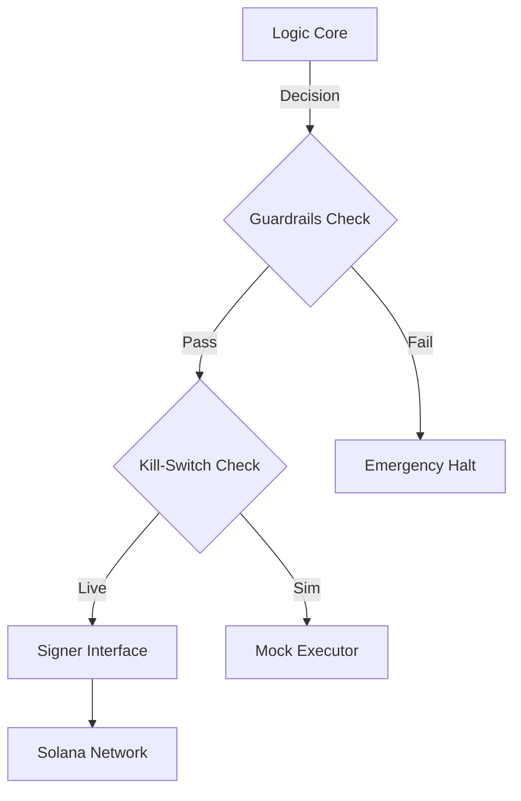

# ⚡ Talos: Security-Aware Autonomous Agent on Solana

**Talos** is an experimental framework for autonomous financial agents, prioritizing **failure recovery** and **explicit risk boundaries**.

Instead of a "black box" bot, Talos implements a transparent **Vault Architecture** where the agent's decision logic is separated from asset custody.

## 🎯 Core Features

### 1. 🛡️ The "Failover" Engine
Traditional bots crash when the network lags. Talos degrades gracefully:
- **Live Mode:** High-frequency execution via Helius RPC.
- **Simulation Mode:** If risk checks fail (e.g., wallet empty), it instantly switches to a **Mock Protocol** to preserve system uptime.

### 2. 🔐 Key Abstraction
We define a clear `Signer` interface.
- **Current:** Local environment keys (Devnet).
- **Future:** Hardware/Multisig signer support (Architecture ready).

### 3. 🛑 Guardrails & Kill-Switch
Safety is enforced at the code level:
- **Hard Block:** `TALOS_MODE=SIMULATION` physically prevents outbound transactions.
- **Limits:** Max transactions per session and daily loss limits are hardcoded.

---

## 🛠️ Architecture

## ⚠️ Disclaimer
This is a hackathon submission demonstrating architectural concepts. **Do not use with real assets.**

*Built for the Solana Colosseum Hackathon.*
