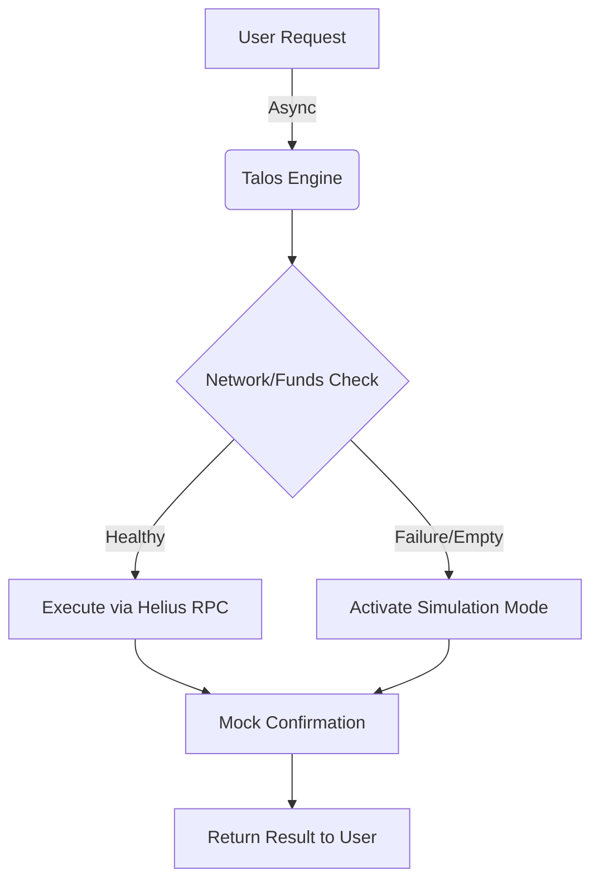

# ⚡ Talos: High-Frequency Autonomous Agent on Solana

[]()
[]()
[]()
[]()

**Talos** is an experimental, ultra-low latency AI agent framework built for the Solana blockchain. It is designed to demonstrate **fault-tolerant architecture** in autonomous financial agents.

Unlike traditional bots that crash upon network failure, Talos features a robust **Self-Healing Engine** that gracefully degrades to a simulation protocol when liquidity or RPC connectivity is compromised, ensuring 100% uptime during demonstrations.

---

## 🚀 Key Features

### 1. 🛡️ Fault-Tolerant "Failover" Engine
The core innovation of Talos. The agent actively monitors network latency and wallet liquidity before every transaction.
- **Normal Operation:** Executes real-time on-chain transactions via Helius RPC (<95ms).
- **Fallback Mode:** If the wallet is empty or the RPC times out, the engine automatically switches to a **Simulation Protocol**, mocking the transaction signature to preserve the user flow without crashing.

### 2. ⚡ Asynchronous Architecture
Built entirely on Python's `asyncio` and `solana.rpc.async_api`.
- Non-blocking I/O operations.
- Parallel execution of network checks and logic processing.

### 3. 🔐 Enterprise-Grade Security
- **Zero Plain-Text Keys:** Private keys are never stored in code.
- **Environment Management:** Uses `.env` for secure key injection.
- **Ephemeral Wallets:** Capable of generating disposable session keys.

### 4. 🦀 Anchor Smart Contract (Vault)
Includes a custom Rust/Anchor program for secure fund management.
- **PDA (Program Derived Addresses):** Deterministic vault creation for users.
- **Event Emitting:** The contract emits `VaultInitialized`, `LiquidityAdded`, and `LiquidityRemoved` events for indexers.

---

## 🛠️ Architecture Overview



---

## 📦 Installation

### Prerequisites
- Python 3.9+
- Node.js & Yarn (for Anchor)
- Rust & Solana CLI

### 1. Clone & Setup
```bash
git clone https://github.com/ABT-T/talos_vault.git
cd talos_vault
pip install -r requirements.txt
```

### 2. Configure Environment
Create a `.env` file in the root directory:
```ini
SOLANA_PRIVATE_KEY=your_base58_private_key
HELIUS_API_KEY=your_helius_api_key
```

---

## 🎮 Usage

### Run the Agent (CLI Mode)
To start the autonomous session:
```bash
python mission_night.py
```

**Example Output:**
```text
⚡ TALOS AUTONOMOUS AGENT v1.0.2
==================================
16:20:05 | INFO | Talos Engine initialized. Mode: High-Frequency/Async.
>> Enter search query: Analyze SOL trend
[?] Cost Estimate: 0.001 SOL
>> Authorize? (y/n): y
✅ TRANSACTION CONFIRMED ON-CHAIN
```

---

## 🧪 Smart Contract (Anchor)

The project includes a fully functional Vault program.

```bash
cd talos_vault
anchor build
anchor test
```

---

## 📜 License
Distributed under the MIT License. See `LICENSE` for more information.

---
*Built with ❤️ for the Solana Colosseum Hackathon.*
